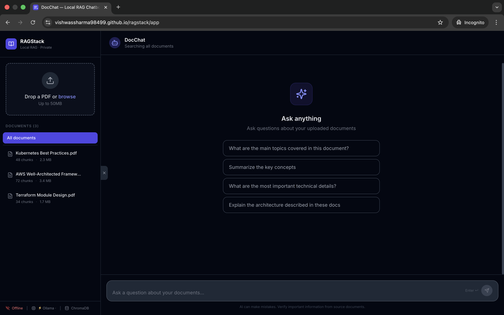
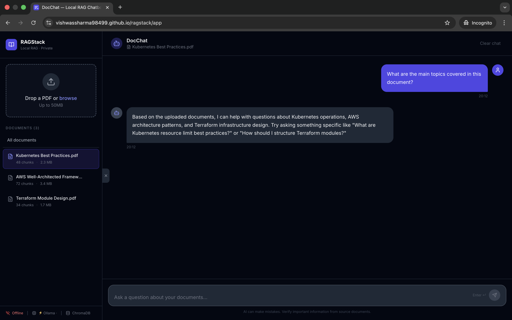

# DocChat — Local RAG Chatbot for Technical PDFs

[](https://python.org)
[](https://fastapi.tiangolo.com)
[](https://react.dev)
[](https://typescriptlang.org)
[](https://langchain.com)
[](https://trychroma.com)
[](https://docker.com)
[](LICENSE)

> Chat with your technical PDFs entirely locally — no data leaves your machine. Powered by Mistral via Ollama, LangChain, ChromaDB, and sentence-transformers.

---

## ✨ Features

- **100% local inference** — Mistral 7B runs on-device via Ollama. Your documents never leave your machine.
- **Intelligent chunking** — Recursive text splitting with configurable chunk size and overlap for optimal retrieval
- **Semantic search** — `all-MiniLM-L6-v2` embeddings with cosine similarity retrieval from ChromaDB
- **Streaming responses** — Server-Sent Events (SSE) for real-time token streaming
- **Chat history** — Multi-turn conversations with context window management
- **Source attribution** — Every answer shows which document chunks were used
- **Multi-document** — Upload multiple PDFs and chat across all or focus on one
- **Demo mode** — Pre-loaded sample documents for portfolio demos
- **Groq fallback** — Swap Ollama for Groq cloud API with a single env var for hosted deployments

---

## 🏗️ Architecture

```
┌─────────────────────────────────────────────────────────────────────┐
│                         User Browser                                │
│                    React + TypeScript + Vite                        │
└───────────────────────────┬─────────────────────────────────────────┘
                            │ HTTP / SSE
                            ▼
┌─────────────────────────────────────────────────────────────────────┐
│                      FastAPI Backend                                │
│                                                                     │
│  ┌──────────────┐  ┌──────────────┐  ┌──────────────────────────┐  │
│  │  /documents  │  │   /chat      │  │       /health            │  │
│  │   upload     │  │   stream     │  │                          │  │
│  └──────┬───────┘  └──────┬───────┘  └──────────────────────────┘  │
│         │                 │                                         │
│  ┌──────▼───────┐  ┌──────▼────────────────────────────────────┐   │
│  │ PDF Service  │  │              RAG Service                  │   │
│  │ PyMuPDF      │  │                                           │   │
│  │ Chunking     │  │  1. Embed query (HuggingFace)             │   │
│  │ Embedding    │  │  2. Retrieve top-k chunks (ChromaDB)      │   │
│  └──────┬───────┘  │  3. Build prompt with context            │   │
│         │          │  4. Stream answer (Ollama/Groq)           │   │
│         │          └──────────────────┬────────────────────────┘   │
│         │                             │                             │
│  ┌──────▼─────────────────────────────▼────────────────────────┐   │
│  │                      Core Layer                             │   │
│  │  ┌───────────────┐  ┌───────────────┐  ┌────────────────┐  │   │
│  │  │   ChromaDB    │  │  HuggingFace  │  │ Ollama/Groq    │  │   │
│  │  │ Vector Store  │  │  Embeddings   │  │   LLM Client   │  │   │
│  │  │ (persistent)  │  │ MiniLM-L6-v2  │  │ (Mistral 7B)  │  │   │
│  │  └───────────────┘  └───────────────┘  └────────────────┘  │   │
│  └──────────────────────────────────────────────────────────────┘   │
└─────────────────────────────────────────────────────────────────────┘
            │                                      │
            ▼                                      ▼
┌────────────────────────┐            ┌────────────────────────┐
│      ChromaDB          │            │        Ollama          │
│   /data/chroma         │            │   localhost:11434      │
│  (Docker volume)       │            │   mistral:latest       │
└────────────────────────┘            └────────────────────────┘
```

### RAG Pipeline — Step by Step

```
PDF Upload                  Query
    │                          │
    ▼                          ▼
Load PDF              Embed query with
(PyMuPDF)             MiniLM-L6-v2
    │                          │
    ▼                          ▼
Split into            Similarity search
800-token chunks      in ChromaDB (top-4)
with 150 overlap              │
    │                          ▼
    ▼                   Format context
Embed each chunk      from retrieved docs
(MiniLM-L6-v2)                │
    │                          ▼
    ▼                  Build prompt:
Store in              [System + Context
ChromaDB              + History + Query]
                               │
                               ▼
                       Stream response
                       from Mistral 7B
                               │
                               ▼
                     Return answer +
                     source citations
```

---

## 🛠️ Tech Stack

| Layer | Technology | Purpose |
|---|---|---|
| LLM | Ollama + Mistral 7B | Local inference, no API key needed |
| LLM (cloud) | Groq + Llama3-8B | Free hosted fallback |
| Orchestration | LangChain 0.2 | RAG pipeline, prompt management |
| Embeddings | HuggingFace sentence-transformers | `all-MiniLM-L6-v2` text embeddings |
| Vector Store | ChromaDB | Persistent embedding storage & retrieval |
| PDF Parsing | PyMuPDF | Fast, accurate PDF text extraction |
| Backend | FastAPI + Python 3.11 | REST API + SSE streaming |
| Frontend | React 18 + TypeScript + Vite | SPA with real-time streaming UI |
| Styling | Tailwind CSS v3 | Utility-first dark theme |
| Containerization | Docker + Docker Compose | One-command local deployment |

---

## 🚀 Running Locally

### Prerequisites

- [Docker Desktop](https://www.docker.com/products/docker-desktop/) (v24+)
- 8GB RAM minimum (16GB recommended for Mistral)
- ~5GB disk space (Mistral model + dependencies)

### One-command start

```bash
# Clone the repo
git clone https://github.com/YOUR_USERNAME/docchat-rag.git
cd docchat-rag

# Start everything (pulls Mistral on first run — ~4GB)
chmod +x scripts/start.sh
./scripts/start.sh
```

Then open **http://localhost:3000** 🎉

> **First startup note:** Mistral (~4GB) is downloaded on first run. This takes 5-15 minutes depending on your internet. Monitor with: `docker compose logs -f ollama-init`

### Manual Docker Compose

```bash
# Build and start all services
docker compose up --build

# Run in background
docker compose up --build -d

# View logs
docker compose logs -f

# Stop
docker compose down
```

### Services after startup

| Service | URL | Description |
|---|---|---|
| Frontend | http://localhost:3000 | React chat UI |
| Backend API | http://localhost:8000 | FastAPI |
| API Docs | http://localhost:8000/docs | Swagger UI |
| Ollama | http://localhost:11434 | LLM server |

### Using Groq instead of Ollama

Perfect for machines with limited RAM, or for cloud deployment:

```bash
# 1. Get a free API key at https://console.groq.com
# 2. Set it in backend/.env:
echo "USE_GROQ=true" >> backend/.env
echo "GROQ_API_KEY=your_key_here" >> backend/.env

# 3. Start without Ollama
docker compose -f docker-compose.groq.yml up --build
```

### Demo Mode

To preload sample PDFs so visitors can try the app without uploading:

```bash
# 1. Place PDFs in backend/demo_pdfs/
# 2. Enable demo mode
echo "DEMO_MODE=true" >> backend/.env
docker compose up --build
```

---

## 📁 Project Structure

```
docchat-rag/
├── backend/
│   ├── app/
│   │   ├── api/
│   │   │   ├── chat.py          # Chat endpoint + SSE streaming
│   │   │   ├── documents.py     # PDF upload/list/delete
│   │   │   └── health.py        # Health check
│   │   ├── core/
│   │   │   ├── config.py        # Pydantic settings
│   │   │   ├── llm.py           # Ollama/Groq LLM client
│   │   │   └── vectorstore.py   # ChromaDB init & operations
│   │   ├── models/
│   │   │   └── schemas.py       # Pydantic request/response models
│   │   ├── services/
│   │   │   ├── pdf_service.py   # PDF loading, chunking, embedding
│   │   │   ├── rag_service.py   # RAG retrieval + generation pipeline
│   │   │   ├── document_registry.py  # Document metadata persistence
│   │   │   └── demo_service.py  # Demo PDF loader
│   │   └── main.py              # FastAPI app + CORS + lifespan
│   ├── demo_pdfs/               # Place demo PDFs here
│   ├── requirements.txt
│   ├── Dockerfile
│   └── .env
├── frontend/
│   ├── src/
│   │   ├── components/
│   │   │   ├── App.tsx          # Root layout, sidebar + chat
│   │   │   ├── ChatWindow.tsx   # Message area + suggestions
│   │   │   ├── ChatInput.tsx    # Input with streaming stop button
│   │   │   ├── MessageBubble.tsx # Markdown renderer + source viewer
│   │   │   ├── PDFUploader.tsx  # Drag-and-drop upload with progress
│   │   │   ├── DocumentList.tsx # Sidebar document selector
│   │   │   └── StatusBar.tsx    # LLM + ChromaDB health indicator
│   │   ├── hooks/
│   │   │   ├── useChat.ts       # Chat state + SSE streaming
│   │   │   └── useDocuments.ts  # Document CRUD state
│   │   ├── services/
│   │   │   └── api.ts           # Axios API client
│   │   └── types/
│   │       └── index.ts         # TypeScript interfaces
│   ├── Dockerfile
│   └── nginx.conf
├── scripts/
│   └── start.sh                 # Automated startup script
├── docker-compose.yml           # Full stack (with Ollama)
├── docker-compose.groq.yml      # Cloud mode (Groq, no Ollama)
└── README.md
```

---

## 📸 Screenshots

> _Add screenshots here after running the app locally_

| Upload & Chat | Source Citations |
|---|---|
|  |  |

---

## ⚙️ Configuration

All config lives in `backend/.env`:

```env
# LLM (local)
OLLAMA_BASE_URL=http://ollama:11434
OLLAMA_MODEL=mistral              # or llama3, phi3, gemma2

# LLM (cloud fallback)
USE_GROQ=false
GROQ_API_KEY=                     # from console.groq.com
GROQ_MODEL=llama3-8b-8192

# Embeddings
EMBEDDING_MODEL=sentence-transformers/all-MiniLM-L6-v2

# Chunking (tune for your documents)
CHUNK_SIZE=800                    # tokens per chunk
CHUNK_OVERLAP=150                 # overlap between chunks

# Retrieval
RETRIEVAL_K=4                     # chunks to retrieve per query

# Demo
DEMO_MODE=false
```

---

## 🔬 How It Works — RAG Pipeline

**Retrieval-Augmented Generation (RAG)** combines a retrieval system with a generative model:

1. **Ingestion** — PDFs are parsed with PyMuPDF, split into 800-token chunks (with 150-token overlap to avoid cutting mid-sentence), and each chunk is embedded using `sentence-transformers/all-MiniLM-L6-v2` (384-dimension vectors). Embeddings are stored persistently in ChromaDB.

2. **Retrieval** — When a user asks a question, the query is embedded with the same model and ChromaDB performs cosine similarity search to return the top-4 most relevant chunks.

3. **Generation** — Retrieved chunks are formatted into a context block and injected into the LLM prompt alongside conversation history. Mistral then generates a grounded answer that only uses the provided context — preventing hallucinations about content not in your documents.

4. **Streaming** — The LLM response is streamed token-by-token via SSE (Server-Sent Events) to the browser, giving a real-time typing effect.

---

## 📄 License

MIT — see [LICENSE](LICENSE)
